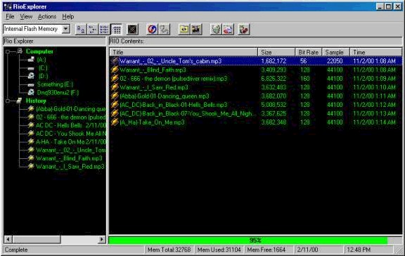



## Diamond Rio Explorer

### Description

This program is an interface to the Diamond Rio 300 MP3 player. The RioExplorer offers an explorer type interface to the Diamond Rio, it is also compatible with memory cards. Features include random playlists from directories, random playlists from winamp playlist files, drag and drop add, playlist history, buffered changes, customizable UI. In addition to the UI, I have included the C++ source code for the ActiveX control that acts as the interface to the Diamond Rio. Please Vote if you like it! :)
 
### More Info
 
This program requires the Sheridan Controls Tree View.

             |
---                |---
**Submitted On**   |2001-05-15 14:01:06
**By**             |[Tom Bruinsma](https://github.com/Planet-Source-Code/PSCIndex/blob/master/ByAuthor/tom-bruinsma.md)
**Level**          |Intermediate
**User Rating**    |5.0 (20 globes from 4 users)
**Compatibility**  |VB 5\.0, VB 6\.0
**Category**       |[Sound/MP3](https://github.com/Planet-Source-Code/PSCIndex/blob/master/ByCategory/sound-mp3__1-45.md)
**World**          |[Visual Basic](https://github.com/Planet-Source-Code/PSCIndex/blob/master/ByWorld/visual-basic.md)
**Archive File**   |[Diamond Ri196485152001\.zip](https://github.com/Planet-Source-Code/tom-bruinsma-diamond-rio-explorer__1-23199/archive/master.zip)

